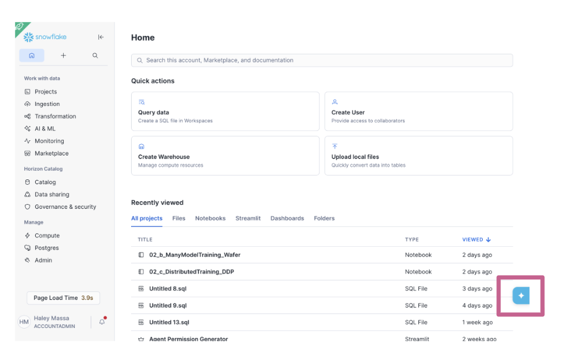

# Snowflake CoCo Foundations
<!-- ------------------------ -->
## Overview

Cortex Code (CoCo) is Snowflake's AI coding agent built to accelerate data and AI workflows directly inside your Snowflake environment. It understands your data catalog, executes SQL as your identity, and integrates natively with dbt, Git, Python, and Streamlit.

This guide walks you through completing a hands-on workshop covering three real-world scenarios: building a Dynamic Table pipeline, maintaining and evolving it, and creating a Cortex Agent with a semantic view.

### Prerequisites
- A Snowflake account with CoCo enabled

### What You'll Learn
- How to access CoCo via Snowsight (UI)
- How to build a Dynamic Table pipeline with CoCo
- How to maintain a pipeline 
- How to create a Cortex Agent with a semantic view and evaluate its performance

### What You'll Build
- A multi-source Accounts Payable (AP) invoice pipeline using Dynamic Tables 
- A Cortex Agent grounded on a semantic view, with an evaluation framework

<!-- ------------------------ -->
## Access CoCo in Snowsight

You will access CoCo directly from the Snowflake UI.

In Snowsight, click the **blue star icon** in the bottom right corner to open the CoCo panel.



This gives you immediate access to CoCo without any local installation. 

<!-- ------------------------ -->
## Lab Setup

Before starting the demos, run the setup scripts to create the workshop environment and load sample data. These files are in the `assets/` folder of [this repo](https://github.com/hindcraig3/cortex-code-foundations/tree/main/assets).

### Step 1: Create the Workshop Environment

1. Copy the SQL from the [00_snowday_setup.sql](https://github.com/hindcraig3/cortex-code-foundations/blob/main/assets/00_snowday_setup.sql) file
2. Open Workspaces in Snowsight ( via the Projects --> Workspaces menu)
3. Add a new SQL File
4. Paste the SQL into the new file. 
5. Select "Run All" to run all the statements. This creates:
- `COCO_WORKSHOP` database
- `PIPELINE_LAB` and `SOURCE_DATA` schemas
- `COCO_WORKSHOP_WH` warehouse (X-Small, auto-suspend 120s)
- Tags for optional governance exercises

### Step 2: Load Sample Data

1. Copy the SQL from the [00_sample_data.sql](https://github.com/hindcraig3/cortex-code-foundations/blob/main/assets/00_sample_data.sql) file
2. Add a new SQL File into your Workspace
3. Paste the SQL into the new file. 
4. Select "Run All" to run all the statements. This creates and populates:
- `BRONZE_SAP_AP_INVOICES` — 15 SAP invoices (USD, EUR, GBP)
- `BRONZE_ORACLE_AP_INVOICES` — 15 Oracle invoices (USD, EUR, GBP)
- `BRONZE_BAAN_AP_INVOICES` — 10 Baan invoices (EUR, GBP) — used in Demo 2
- `BRONZE_WORKDAY_AP_INVOICES` — 10 Workday invoices (USD, GBP, EUR) — used in Demo 2
- `AGENT_EVAL_SET` — 15 golden evaluation questions — used in Demo 3


<!-- ------------------------ -->
## Workshop Overview

This workshop follows a single Accounts Payable (AP) invoices storyline across three demos — from data discovery through operationalization and optional agent design.

<!-- ------------------------ -->
## Demo 1: Pipeline Builder

Finance needs a trusted AP invoices layer. SAP and Oracle invoice data already exist in Snowflake, but there is no standardized Silver object yet. The goal is a single, well-modeled table that can be explained, monitored, and evolved without repeating discovery work each time a requirement changes.

### Step 1.1 – Discover the Source

Begin with data discovery, a natural first move when you enter a new schema.

**Prompt:**
```
What tables are in the `COCO_WORKSHOP.SOURCE_DATA` schema?
For each table, give me a one-line description of what it appears to contain and identify
which ones are most relevant to an AP invoices Silver layer.
```

> **What to look for:** A short list of tables relevant to the AP workflow, with enough description to orient yourself without manually opening each object.

### Step 1.2 – Compare SAP and Oracle Invoice Schemas

Once you know which tables matter, compare them to get the shortest path to a clean normalization plan.

**Prompt:**
```
Compare the columns between
COCO_WORKSHOP.SOURCE_DATA.BRONZE_SAP_AP_INVOICES and
COCO_WORKSHOP.SOURCE_DATA.BRONZE_ORACLE_AP_INVOICES.
Return:
- Equivalent fields with different names
- Fields that require type normalization or default values
- Differences that should remain open questions instead of becoming hidden assumptions
```

> **What to look for:** Equivalent business fields with different names, normalization work you should expect before building Silver, and open questions that should stay explicit for later review.

### Step 1.3 – Generate the Silver Dynamic Table

For this step we are going to load a dynamic-tables skill into CoCo then get CoCo to create the SQL required to create our dynamic table.

**1.3.1 - Upload the dynamic-tables skill**

1. Download the [dynamic-tables.zip](https://github.com/hindcraig3/cortex-code-foundations/blob/main/assets/dynamic-tables.zip) file from the `/assets` folder.
2. Unzip the dynamic-tables.zip. 
3. In Snowsight click the **+** icon in CoCo and select **Upload skill folder(s)**
4. Browse to the location where you unzipped the dynamic-tables.zip file. 
5.Select the folder then click the **upload** button . Note: Select the folder not the zip file. 
6. When prompted click **Upload skill(s)**
7. You should see a success message at the top of the screen once it has been uploaded. 
8. Check it is loaded by typing **/dynamic** into CoCo. You should see the **dynamic-tables** skill appear in the skill list. 

**1.3.2 - Get CoCo to design the dynamic table**

1. Turn on **Plan Mode** (click the Plan toggle in CoCo to turn on). This allows CoCo to think through a multi-step task and design a plan on how the task can be achieved.  
2. Then run the following prompt: 

```
Use database COCO_WORKSHOP and schema PIPELINE_LAB for outputs.
Create a Dynamic Table called SILVER_AP_INVOICES in my current schema by combining
COCO_WORKSHOP.SOURCE_DATA.BRONZE_SAP_AP_INVOICES and
COCO_WORKSHOP.SOURCE_DATA.BRONZE_ORACLE_AP_INVOICES.
```

  
> **What to look for:** A clean first-pass Dynamic Table definition with explainable design choices. Note how CoCO outlines its approach including the SQL it is proposing to create.

**1.3.3 - Get CoCo to build the plan**

1. Toggle **Plan Mode** to **off**. 
2. Type the following prompt and to tell CoCo to proceed with building the dynamic table:

```
Proceed with the plan. Create a new SQL file in the workspace with all the code.
```

> **What to look for:** CoCo will create the SQL required to implement the dynamic table. It should also create a new file in your workspace containing the SQL statements. 

**1.3.4 - Review the SQL file that CoCo generated**

1. Once the code has been generated you can review it. Click the **Keep All** button to retain the changes made by CoCo.

>**NOTE:** CoCo should deploy the dynamic table in the previous step. If it did not you can run all the SQL statements in the SQL file using the "Run All" command.

### Step 1.4 – Explore the dynamic-table skill

Skills are reusable workflows that tell CoCo how to handle a specific Snowflake task. Instead of responding in a completely open-ended way, a skill provides domain context, expected inputs, a defined process, and structured outputs. 

1. First, see what skills are available. Ask CoCo the following

    ```
    List the skills you have
    ```

2. Then inspect the Dynamic Tables skill:

    ```
    What does the dynamic-tables skill do? Summarize when I should use it,
    what inputs it expects, and what kinds of output it returns.
    ```

3. Now lets apply it to the `SILVER_AP_INVOICES` you created earlier. 
Type **/dynamic-table** into CoCo and select the dynamic-tables skill from the results list. This tells CoCo to use this particular skill. Then copy and paste this prompt into CoCo:

    ```
    Analyze the Dynamic Table SILVER_AP_INVOICES in my current schema.
    Return:
    1. The recommended TARGET_LAG choice for this workflow and why
    2. SQL to inspect current state, lag, and refresh history
    3. The main failure or staleness patterns to watch for
    4. A short best-practices checklist for operating this table well
    ```

> **What to look for:** A runbook you would actually keep — a couple of monitoring queries and a concise operating checklist, not generic advice.

### Step 1.5 – Save a Proof Query *(optional)*

1. Create a proof query you can rerun after every change. Copy the following prompt into CoCo.

    ```
    Give me one concise proof query for SILVER_AP_INVOICES that shows record counts by SOURCE_SYSTEM and is easy to rerun after future changes.
    ```

    > **What to look for:** A concise SQL query that can be reused after every change.

2. Copy the SQL that CoCo creates, and paste it into a new worksheet so you can reuse it later.

Now you have a Silver-grade AP invoices Dynamic Table that automatically updates from multiple tables in the Bronze layer, an operating runbook generated by CoCo which leveraged the dynamic table skill, and a proof query you can rerun after each change to your dynamic table.

<!-- ------------------------ -->
## Demo 2: Managing changing requirements 

A month later, the business sends a set of new requirements for the AP invoices pipeline. New source systems must be added, field requirements have changed, and some definitions need clarification. 

### The new requirements

**Download** the three CSV files prepared by the Finance Transformation PMO in the `assets/` folder of [this repo](https://github.com/hindcraig3/cortex-code-foundations/tree/main/assets). 
The files to download are:

- `sample_business_requirements_source_onboarding.csv` — new source systems (Baan, Workday), owners, priorities, and go-live targets
- `sample_business_requirements_column_mapping.csv` — field-level mappings for both new sources into the Silver schema
- `sample_business_requirements_business_rules.csv` — BR-001 through BR-010 covering status normalization, deduplication logic, currency handling, and open questions


### Step 2.1 – Ask CoCo to help you understand the new requirement 


1. Upload each file to CoCo. Click the **+** icon in CoCo and select **upload**. Find the first file you downloaded and upload it.
2. Repeat for the other 2 files. 
3. Copy the following prompt into CoCo

    ```
   Review the attached business requirements for changes to the AP Invoices pipeline.  Summarize the changes that affect the AP invoices pipeline.
    Return:
    - New source systems being introduced
    - New fields or business rules that affect the Silver layer
    - Ambiguities or open questions that should be resolved before implementation
    ```

> **What to look for:** A clear distinction between requirements and assumptions, and proposed changes


### Step 2.2 – Ask CoCo to prepare a plan for the required changes

1. Switch COCo to **Plan** mode
2. Copy this prompt into CoCo:

    ```
    Create a plan for implementing the new business requirements. 
    ```

> **What to look for:**  A plan that outlines the proposed changes to the AP invoice pipeline.

### Step 2.3 – Apply the Update

1. Now get CoCO to proceed with implementing the plan. Copy the following prompt into CoCo:

    ```
    Proceed with the build. Update the existing SQL file with the changes. Also return:
    - A short explanation of how the new sources map into the common schema
    - Any assumptions that require engineering review
    - Validation queries that prove the update worked
    ```

> **What to look for:** Updated SQL, explainable source mapping, explicit assumptions, and validation queries.


### Step 2.4 – Review the changes in the SQL file

1. Once the code changes have been generated you can review them. Click the **Keep All** button to retain the changes made by CoCo.

>**NOTE:** CoCo should deploy the dynamic table changes in the previous step. If it did not you can run all the SQL statements in the SQL file using the "Run All" command


At this point you have built a dynamic data pipeline, and then updated it in response to changing business requirements.

<!-- ------------------------ -->
## Demo 3: Build an Agent on the Accounts Payable data *(Optional)*

By this point you have a curated AP invoices Silver object.  Now is the right moment to introduce agents — because you can keep the AI experience grounded in trusted, well-modeled data.

### Step 3.1 – Define the Agent Use Case

Lets use CoCo to help define the value of creating a Cortex Agent on top of our AP invoices data.

1. Copy the following prompt into CoCo

```
Help me define the value of a Cortex agent built on top of SILVER_AP_INVOICES data in my current schema.
Suggest:
- The primary audience for the agent
- The top five business questions the agent might answer
- Guardrails that keep the agent grounded in the curated data
- Any semantic descriptions that would improve answer quality
```


### Step 3.2 – Create a Semantic View over the Silver Data

Create a semantic view that exposes business-friendly dimensions and measures. This is the object the agent will rely on for most of its answers.

1. Copy the following prompt into CoCo
    ```
    Let's start by building the semantic view
    Create a semantic view called SV_AP_ANALYTICS over SILVER_AP_INVOICES.
    It should support natural language questions like:
    - "Total AP spend by vendor over the last 12 months"
    - "Invoice count by month and business unit"
    - "Top 10 vendors by unpaid invoice amount"
    Return:
    - A complete semantic view definition as a new sql file that clearly names business measures and dimensions including semantic definitions.
    - Any assumptions you are making about grain, time dimensions, and vendor identifiers.
    ```

> **What to look for:** A semantic view definition with clear business measures, dimensions, and assumptions.

2. Click the "Keep All" button to retain the changes.
3. Now ask Coco to deploy the semantic view and run a SQL query to validate the semantic view is working. Type or copy the following prompt:

    ```
    Deploy the semantic view and run a validation query against it to verify it is working
    ```
>**NOTE:** CoCo may ask you to "Approve" saving the semantic view.

### Step 3.3 – Create a Cortex Agent

Now lets create a Cortex Agent that uses the semantic view to answer natural-language questions.

1. Copy the following prompt to CoCo:

    ```
    Build a Cortex Agent on SV_AP_ANALYTICS to answer natural language questions about AP spend and invoice aging.
    ```
2. If prompted click "Allow" to allow CoCo to save the agent specification and deploy the agent.

### Step 3.4 – Using skills to assess code against best practice.

Skills can include sub skills that can be used to help verify your code against best practices. For example the semantic-studio skill in CoCo has an "Audit" sub skill. Let's try it out.

1. Copy the following prompt into CoCo

    ```
    Help me audit my Semantic View for best practices and provide suggestions.
    ```

> **What to look for:** An evaluation of the semantic view against best practices, with concrete suggestions for improving answer quality.

<!-- ------------------------ -->
## Set Up the Auto-Grader if you want a digital badge ( optional)

If you collect digital badges then you can complete this step to receive a digital badge. 

1. Navigate to : https://northstar.streamlit.app/Auto-Grader
2. Select the **CoCo Foundations: Getting Started with CoCo** workshop
3. Enter your Email and Name. **Your email must be the same as the one you used to register**
4. Click **Generate SQL**
5. Copy the SQL that is generated
6. Go back to Workspaces and create a new SQL file.
7. Paste the SQL into the new SQL file.
8. Run all the SQL statements using **Run All**
9. If you have completed each step of the lab correctly you will see a "**Congratulations! You have successfully completed the Cortex Code Foundations workshop!** message. 

And you are done. 


<!-- ------------------------ -->
## Conclusion And Resources

The core pattern is simple: pick one concrete object, ask CoCo for one concrete artifact, and keep the result in the project.

In Demo 1, this was a Dynamic Table to move data from the bronze layer to the silver layer, a small dynamic table runbook, and a single proof query you can rerun after every change. In Demo 2, it was taking new business requirements and turning that into a structured, reviewable change plan. In Demo 3, you saw how skills can be used to design and build new objects ( a semantic view and an Agent) but also help assess code against best practice. 

### What You Learned
- How to leverage CoCo in Snowsight to accelerate data engineering and AI tasks in Snowflake
- Data discovery, schema comparison, and Dynamic Table creation
- Using Plan Mode to allow CoCo to think through multi step assignments and produce a detailed plan prior to actually creating and running code.
- Utilising bundled skills (`semantic-studio`) and uploading a custom skill (`dynamic-tables`)

### Related Resources
- [Cortex Code in Snowsight Documentation](https://docs.snowflake.com/en/user-guide/cortex-code/cortex-code-snowsight)
- [Dynamic Tables Overview](https://docs.snowflake.com/en/user-guide/dynamic-tables-intro)
- [Cortex Agents Overview](https://docs.snowflake.com/en/user-guide/snowflake-cortex/cortex-agents)
- [Cortex Semantic Views Overview](https://docs.snowflake.com/en/user-guide/views-semantic/overview)


